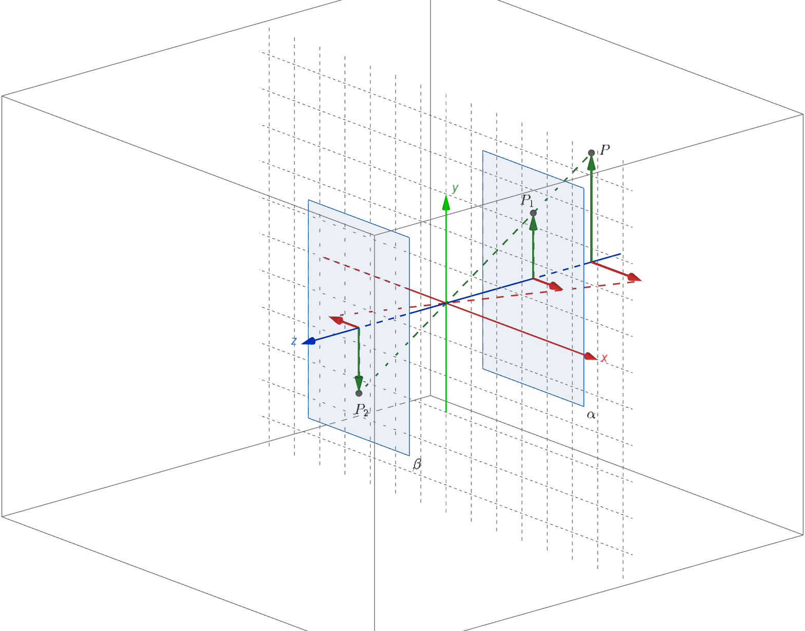
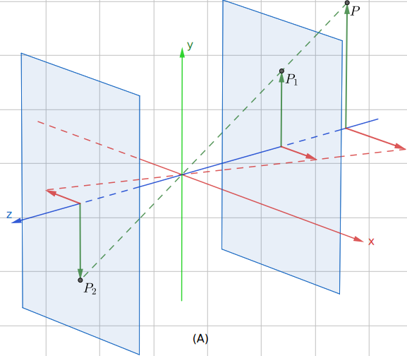

# GeogebraScript

a script helps to export svg for Geogebra 3d calculator.
[Geogebra 3d calculator](https://www.geogebra.org/3d) is an excellent app for 3d graph. But we cannot export the final result to svg file. This script can parse the project file (.ggb) and convert to a set of Geogebra commands which you can load to [Geogebra geometry](https://www.geogebra.org/geometry), then you can export to svg file from Geogebra geometry.

# Usage
```python
python ./GeoGebra3dTo2D.py --dataLocation=./data/OGLCoor_zn.ggb
```
The script will create a folder with your file name (OGLCoor_zn in example) and you can see "commandList.txt" under that folder. Copy the content of "commandList.txt" and paste to [Geogebra geometry](https://www.geogebra.org/geometry).  

# Limitation
- I only support "Segment", "Vector", "Polygon" in the graph, will add "Ray", "Line" soon.  
- Text command from Geogebra failed to support Latex format, so the script didn't create related text to Geogebra geometry. But you can manually create them.

# Example
- Step 1  
Create your graph from [Geogebra 3d calculator](https://www.geogebra.org/3d), choose the best view as you wish.    

- Step 2  
Download the ggb file.  
- Step 3  
Run the script.  
- Step 4  
Open "commandList.txt" and copy all commands. Visit [Geogebra geometry](https://www.geogebra.org/geometry) and create a button (or you can just create a point), right click and go to "Scripting" tab, paste all commands there. Click the button (or the point). Then you can see:  

